---

layout: post
title: 五一青岛浪
category: Other

---
### tips
- 带好学生证

### 气温
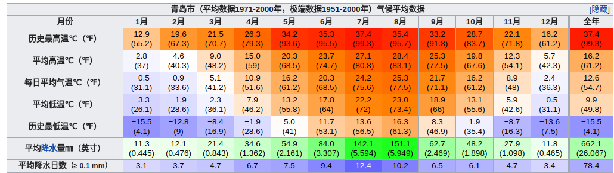

### 往返程
**北京南 - 青岛**
4.30    09:35
5.3     17:09

#### 火车站到住处
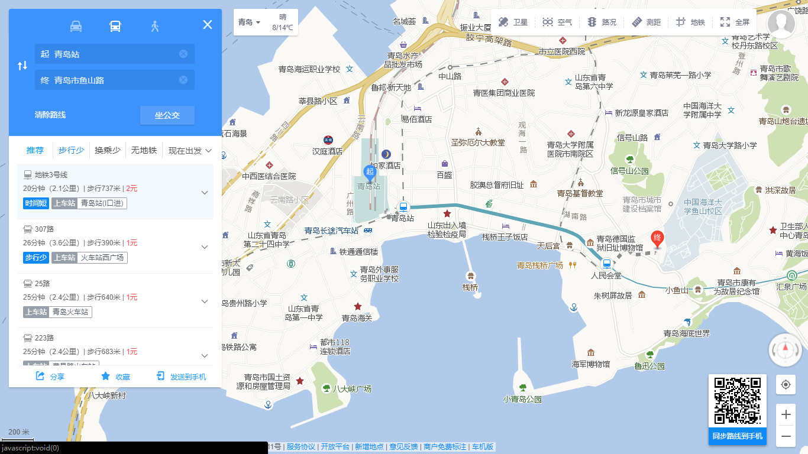

### 候选景点
#### 崂山
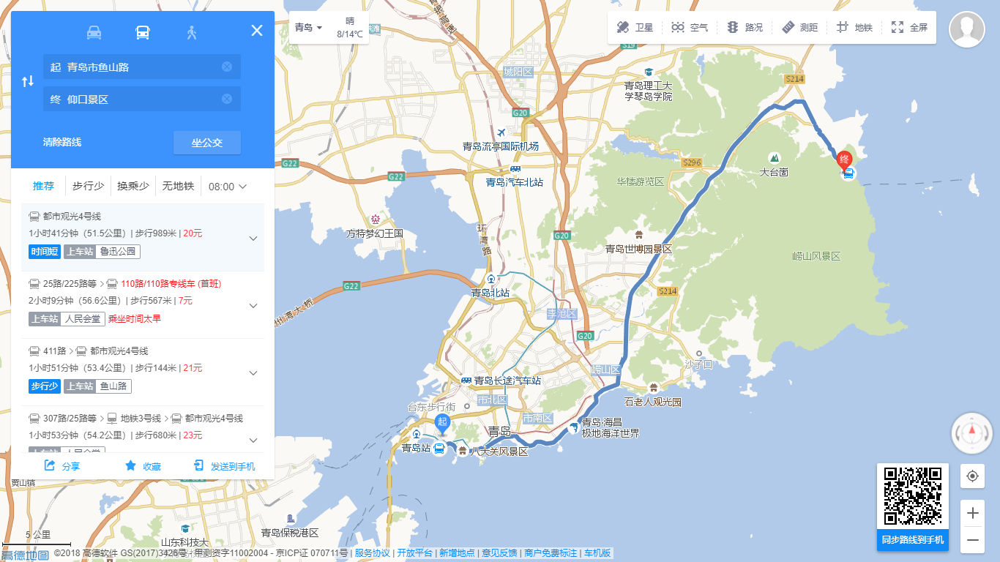

- 共四个景区，去掉道教景区、全程爬山、耗时过多的，比较推荐仰口
- 公交 1h41min
- 爬山，大概玩半天

#### 浮山
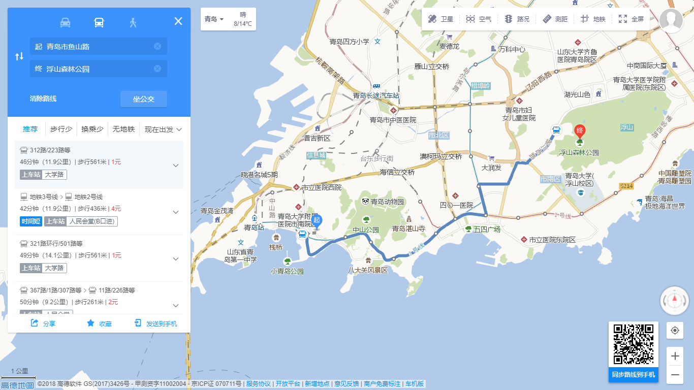

- 公交 46min
- 游玩 3 - 4 小时
- 同学推荐，可看到青岛全景

#### 八大关
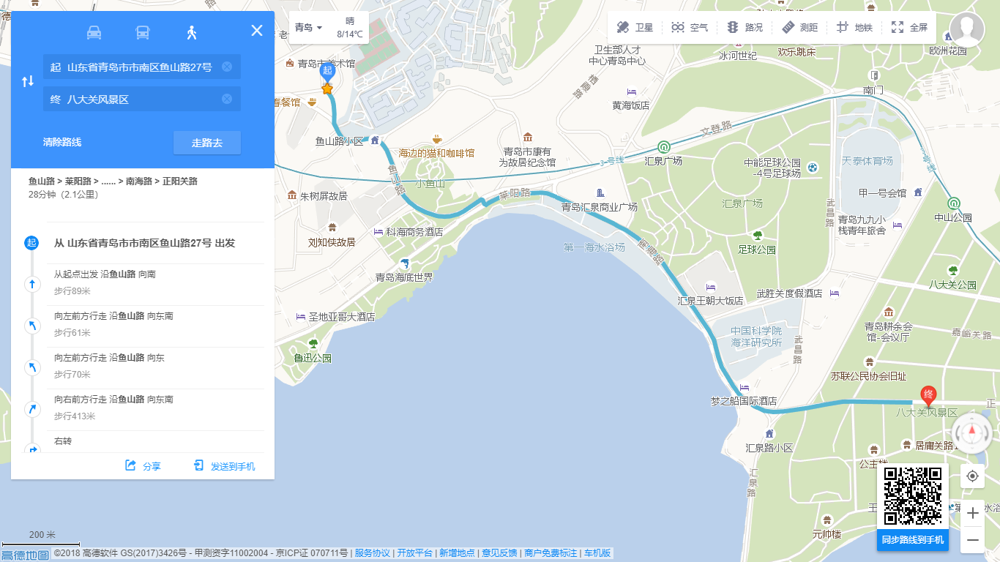
- 走 28min，路过第一海水浴场
- 游玩 3 小时
- 集中了俄、英、法、德、美、日、丹麦等 20 多个国家建筑风格的别墅

#### 第二海滨浴场
- 八大关内
- 沙细
- 水脏？贵？

#### 第一海滨浴场
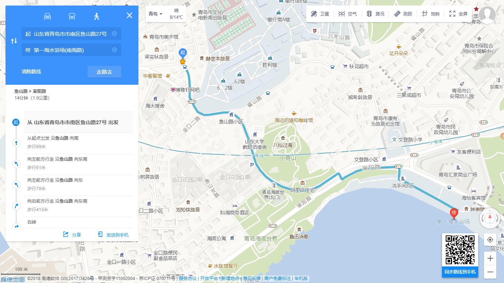
- 走 14min
- 旺季人很多像下饺子，可以先去看看情况再决定下不下水
- 水脏？
- 适合沙滩散步

#### 栈桥公园
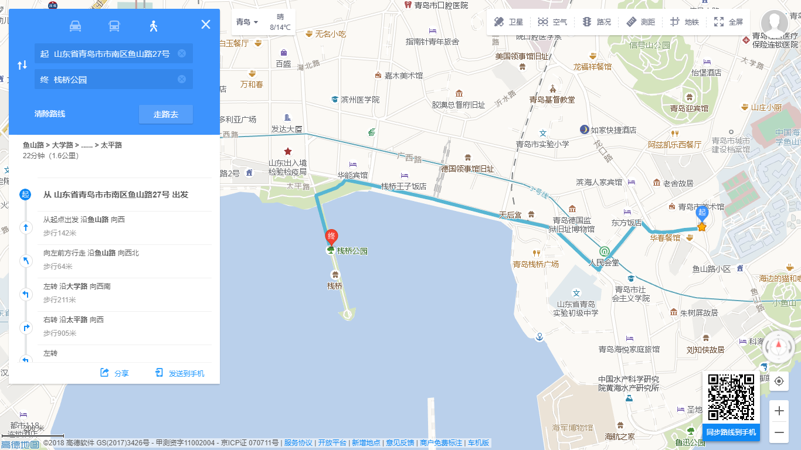
- 走 22min
- 适合散步，可以晚饭后去？
- 人多，景色不算特别好但是青岛著名景点
- 可以喂海鸥

#### 圣弥爱尔大教堂
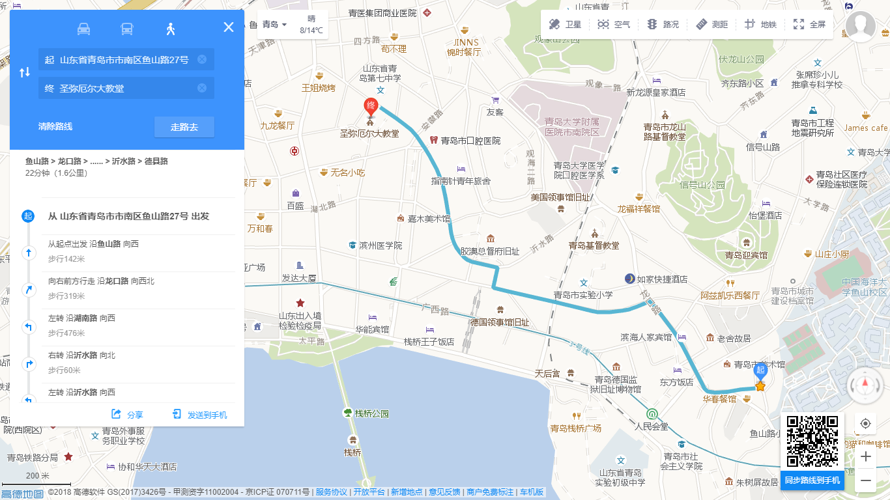
- 走 22min
- 游玩 0.5 - 1 h
- 开放时间
    - 8:00-17:00
    - 每天 6:00 平日弥撒
    - 周日 8:00-9:00 主日弥撒
- 意大利文艺复兴风格

#### 奥帆中心
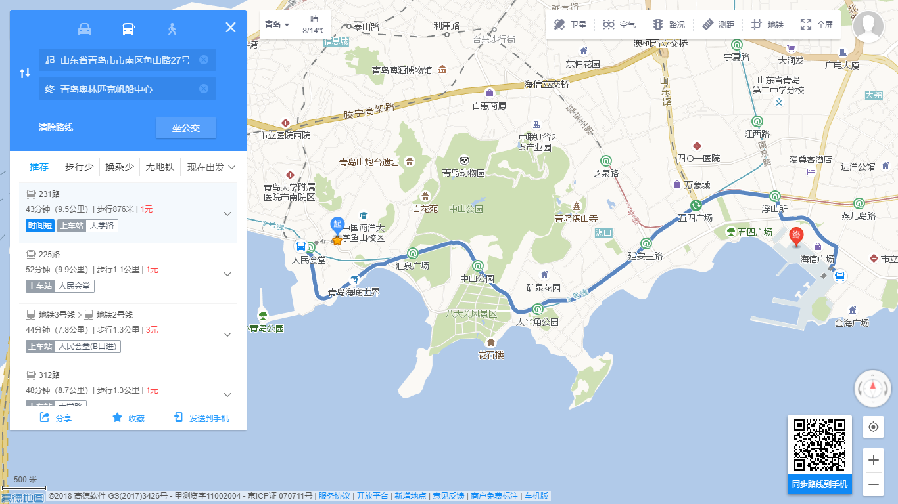
- 公交 43min
- 散步？
- 附近有一个情人坝白灯塔

#### 德国监狱旧址博物馆
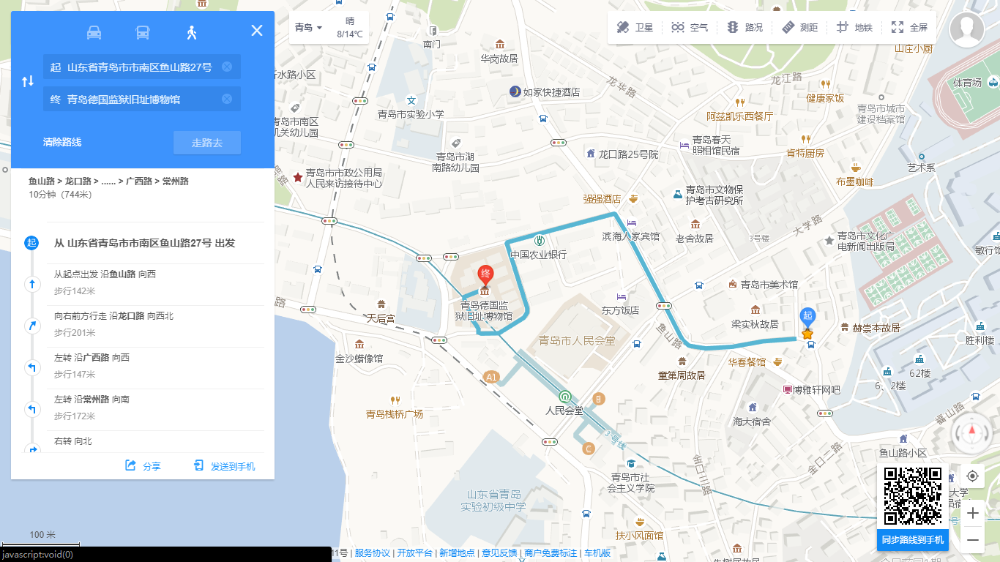
- 走 10min
- 古堡式监狱建筑群，保存完整
- 游玩 1 - 2 h

### 吃
#### 船歌鱼水饺
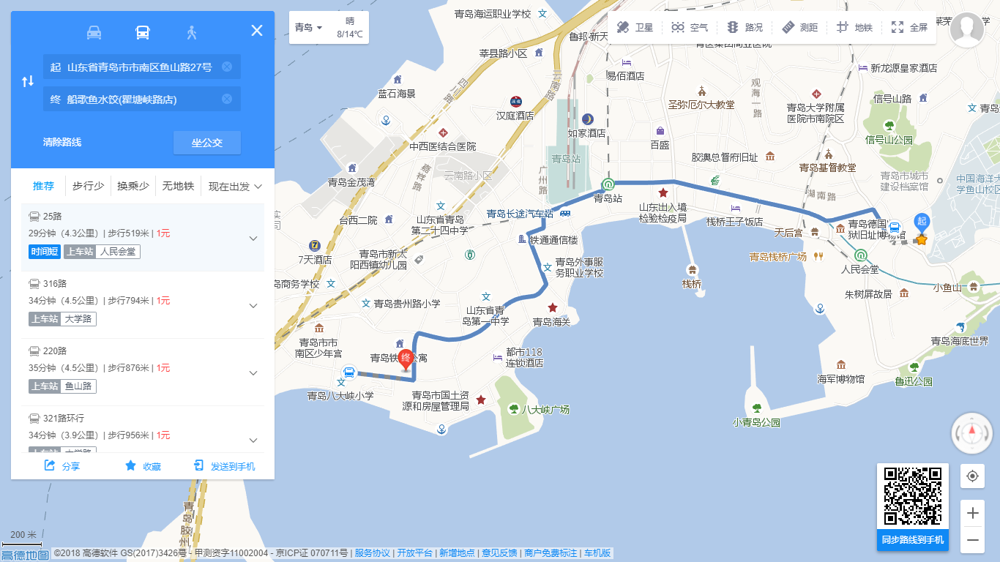
- 人均 80
- 青岛特色鲅鱼水饺
- 超级好吃？
